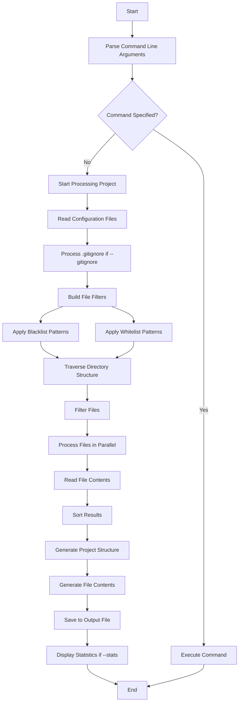

# Contextify


Contextify is a Rust utility that captures the structure and contents of a project directory and saves them into a text file. It's designed for quick documentation of your project's file system.

## Features

- **Complete Capture**: Records the entire file structure and contents of the project.
- **Customizable Filters**: Offers blacklist and whitelist options for targeted scanning.
- **Command-Line Interface**: Simple and easy-to-use command-line tool.
- **Parallel Processing**: Optimized for speed using Rust's parallelism capabilities.
- **Gitignore-Style Patterns**: Uses the same pattern syntax as .gitignore for intuitive filtering.

## Installation

### From Crates

```
cargo install contextify
```

### From Source

Clone the repository and build the project:

```bash
git clone https://github.com/suenot/contextify.git
cd contextify
cargo install --path .
```

## Usage

Navigate to your project directory and run:

```bash
contextify
```

By default, Contextify will scan all files and directories in the current folder and produce an output file called `project_contents.txt`.

### Initialize Global Configuration Files

To create global configuration files in your home directory:

```bash
contextify init
```

This will create `~/.contextify-blacklist` and `~/.contextify-whitelist` files.

### Locate the Configuration Files

To see where Contextify's configuration files are located:

```bash
contextify show-locations
```

This will print the paths to both local and global configuration files.

### Filtering Options

#### Using Configuration Files

- `--blacklist`: Use the blacklist defined in the `.blacklist` file (or `~/.contextify-blacklist`).
- `--whitelist`: Use the whitelist defined in the `.whitelist` file (or `~/.contextify-whitelist`).
- `--gitignore`: Use the patterns from the project's `.gitignore` file as part of blacklist.

#### Using Custom Configuration Files

- `--blacklist-file <PATH>`: Use a custom blacklist file.
- `--whitelist-file <PATH>`: Use a custom whitelist file.

#### Direct Pattern Specification

- `--blacklist-patterns <PATTERNS>`: Specify blacklist patterns directly (comma-separated).
- `--whitelist-patterns <PATTERNS>`: Specify whitelist patterns directly (comma-separated).

#### Output and Information

- `-o, --output <FILE>`: Specify the output file (default: project_contents.txt).
- `-s, --stats`: Display performance statistics and token estimates.
- `-h, --help`: Show brief help information.
- `-V, --version`: Show version information.

### Commands

- `contextify full-help`: Show detailed help information.
- `contextify version`: Show detailed version information.
- `contextify init`: Initialize global configuration files.
- `contextify show-locations`: Show paths to configuration files.

### Examples

Use the default blacklist:

```bash
contextify --blacklist
```

Use the project's .gitignore file:

```bash
contextify --gitignore
```

Combine .gitignore with custom patterns:

```bash
contextify --gitignore --blacklist-patterns "*.tmp,*.bak"
```

Use the default whitelist:

```bash
contextify --whitelist
```

Use custom patterns:

```bash
contextify --blacklist-patterns "target/,.git/,*.log" --output my_project.txt
```

Use both blacklist and whitelist:

```bash
contextify --blacklist --whitelist
```

Use with statistics:

```bash
contextify --stats
```

Show detailed help:

```bash
contextify full-help
```

## Configuration Files

Contextify respects two types of configuration files:

1. **Blacklist (`.blacklist`)**: Exclude certain files/directories.
2. **Whitelist (`.whitelist`)**: Include only certain files/directories.

The configuration files can be found in:
- Local: `./config/.blacklist` and `./config/.whitelist` in the project
- Global: `~/.contextify-blacklist` and `~/.contextify-whitelist` in the home directory

### Example `.blacklist` File

```text
.DS_Store
target/
*.log
```

### Example `.whitelist` File

```text
*.rs
*.md
*.toml
```

## Algorithm

The following diagram illustrates the core algorithm of Contextify:



### Processing Steps:

1. **Parse Command Line Arguments**: Process all options and determine operation mode.
2. **Configuration Loading**: Load blacklist/whitelist patterns from files or command line arguments.
3. **File Selection**: 
   - Apply blacklist to exclude unwanted files
   - Apply whitelist to include only specific files
   - Respect .gitignore patterns if requested
4. **Parallel Processing**: Use Rust's parallel processing to efficiently read and process files.
5. **Output Generation**:
   - Generate a hierarchical view of the project structure
   - Include file contents with proper formatting
6. **Statistics Calculation**:
   - Count files, lines, and characters
   - Estimate token usage for AI context purposes
   - Measure performance metrics

## Performance

Contextify is optimized for speed using Rust's concurrency features, making it significantly faster than the Python implementation (snap2txt).

## License

Contextify is open-sourced software licensed under the MIT license.

## Author

Eugen Soloviov (suenot) 